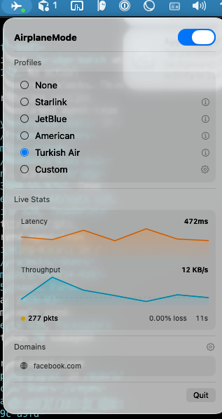

# AirplaneMode

A macOS network profiler that simulates real airplane WiFi. Routes system traffic for matched domains through a local relay that applies packet-level profiling — calibrated from actual inflight measurements.



## The Problem

I needed to test how my app performed on airplane WiFi. The existing tools all fell short:

1. **No jitter model.** Real satellite WiFi has heavy-tailed latency: most packets arrive near base RTT, but a few percent spike to 5-10x. Flight benchmarks show this follows a log-normal distribution. Existing macOS tools (Apple's Network Link Conditioner, `comcast`) apply fixed constant delay with no jitter model at all, which misses the spikes that actually break user experience.

2. **Root required, no domain scoping.** Network Link Conditioner and `comcast` operate at the kernel level (`dummynet`/`pfctl`) and require root. They shape all traffic system-wide — there's no easy way to scope simulation to specific domains while leaving the rest of your network unaffected.

3. **Generic presets.** "Poor WiFi" is not a useful simulation target. GEO satellite on a Turkish Airlines transatlantic flight (870ms RTT, 690 Kbps) is fundamentally different from Viasat Ka-band on a JetBlue domestic hop (593ms RTT, 3.3 Mbps). Without presets calibrated from real flights, you're testing against conditions that don't exist.

## How AirplaneMode Works

AirplaneMode runs entirely in userspace — no root required. A local [MASQUE relay](https://www.rfc-editor.org/rfc/rfc9298) (HTTP/3 + CONNECT-UDP) profiles traffic at the UDP packet level, below QUIC and HTTP/3. A `.mobileconfig` system profile routes only matched-domain traffic through the relay, so **every app on the system** sees the profiled conditions for those domains while the rest of your network is unaffected.

The relay wraps its UDP socket in a simulation layer (SimConn) that applies profiling to every packet independently:

- **Realistic latency variation** — jitter follows a log-normal distribution derived from `(mean, P99)` measurements, producing the heavy-tailed spikes observed in real satellite links instead of uniform noise
- **Non-blocking packet delays** — each packet is delayed independently, so one slow packet doesn't hold up the rest of the stream
- **Per-direction bandwidth throttling** — separate upload and download rate limiting at the packet level, matching asymmetric satellite links
- **Burst packet loss** — when a packet drops, consecutive packets can drop too (configurable burst length), modeling correlated loss on satellite links rather than independent random drops
- **Transparent to the OS** — ECN congestion bits and GSO segmentation metadata pass through untouched, so kernel-level networking features work correctly
- **Native HTTP/3 and QUIC support** — the simulation sits below the QUIC transport layer, so congestion control algorithms respond naturally to the profiled conditions instead of being tricked by artificial buffering

## Presets

Presets are calibrated from real inflight benchmarks — TLS handshake timing, download throughput, and traceroute data collected during actual flights. Jitter parameters (mean, P99) are fit to the observed latency distribution.

| Preset        | RTT    | Bandwidth | Loss | Jitter P99 | Source                                           |
| ------------- | ------ | --------- | ---- | ---------- | ------------------------------------------------ |
| `jetblue`     | ~593ms | 3.3 Mbps  | 0.5% | 1050ms     | JetBlue Viasat Ka-band (DEN PoP, domestic US)    |
| `american`    | ~715ms | 4.2 Mbps  | 0.5% | 763ms      | American Airlines Intelsat GEO (LGA→EYW)         |
| `turkish-air` | ~870ms | 86 KB/s   | 0.5% | 2300ms     | Turkish Airlines Panasonic Ku-band GEO (JFK→IST) |

You can also define custom profiles with arbitrary parameters via the menu bar app or CLI.

### Contribute a preset

On your next flight, run the benchmarking script to collect raw network data. Run it multiple times during the flight — conditions change significantly between phases (climb, cruise, descent) and as passengers connect/disconnect:

```bash
sudo ./scripts/flight-bench.sh takeoff
sudo ./scripts/flight-bench.sh cruising-1h
sudo ./scripts/flight-bench.sh cruising-3h
sudo ./scripts/flight-bench.sh descent
```

This captures TLS handshake timing, bandwidth, traceroute, and packet loss across multiple targets. Output goes to `./traces/` as JSON (~28 KB each).

Then [open a trace submission issue](../../issues/new?template=flight-trace.yml) and attach your files — we'll fit a profile from the data.

## Quick Start

```bash
make setup    # install TLS certificates (may prompt for admin password)
make install  # build and install to ~/.local/bin
```

Then start profiling:

```bash
airplanemode start --profile turkish-air --domains api.example.com,cdn.example.com
```

macOS will prompt you to approve the "AirplaneMode Relay" profile in System Settings. The CLI waits and confirms when traffic starts flowing.

### Switch profiles on the fly

```bash
airplanemode set jetblue     # switch to JetBlue conditions
airplanemode set none        # passthrough (no profiling)
airplanemode status -f       # follow live stats
```

### Stop

```bash
airplanemode stop
```

## Architecture

```
┌───────────────────────────────────────────────────────┐
│  macOS                                                │
│                                                       │
│  App traffic ──→ .mobileconfig routing ──┐            │
│                  (matched domains only)  │            │
│                                          ▼            │
│  ┌──────────────────────────────────────────────┐     │
│  │  MASQUE Relay (localhost:4433, QUIC/HTTP3)    │     │
│  │                                              │     │
│  │  UDP socket                                  │     │
│  │    └─ SimConn (per-packet profiling)          │     │
│  │        ├─ Log-normal jitter                  │     │
│  │        ├─ Bandwidth throttle (up/down)       │     │
│  │        ├─ Burst packet loss                  │     │
│  │        └─ OOB passthrough (ECN/GSO)          │     │
│  │            └─ QUIC transport                 │     │
│  │                └─ HTTP/3 server              │     │
│  │                    ├─ CONNECT (TCP proxy)    │     │
│  │                    └─ CONNECT-UDP (UDP proxy) │     │
│  │                                              │     │
│  │  Control API (localhost:4434, HTTP/1.1)       │     │
│  │    ├─ POST /profile  (switch conditions)     │     │
│  │    ├─ GET  /stats    (live metrics)          │     │
│  │    └─ GET  /health                           │     │
│  └──────────────────────────────────────────────┘     │
│                    │                                  │
│                    ▼                                  │
│              Internet (via direct IP,                 │
│              bypasses relay routing)                   │
└───────────────────────────────────────────────────────┘
```

## Menu Bar App

The SwiftUI menu bar app provides:

- Toggle profiling on/off
- Select preset or define custom profiles
- Configure which domains to profile
- Live stats with sparkline charts (latency, throughput, packet counts)
- Runs as a macOS LaunchAgent for persistence

Launches automatically when you run `airplanemode start`, or run `airplanemode --gui` directly.

## CLI Reference

```
airplanemode start [--profile <id>] [--domains d] Start relay and install system profile
airplanemode stop                                 Stop relay and remove system profile
airplanemode status [-f]                          Show status (--follow for live)
airplanemode set <profile-id>                     Switch profile on the fly
airplanemode profiles                             List available presets
```

## Project Structure

```
AirplaneMode/
├── Makefile                     # Build, setup, and run commands
├── relay/                       # Go MASQUE relay
│   ├── main.go                   # HTTP/3 server, CONNECT + CONNECT-UDP
│   ├── control.go                # Control API (profile switching, stats)
│   └── netsim/                   # Core profiling library
│       ├── conn.go               # SimConn: UDP packet profiling
│       ├── profile.go            # Network profiles, log-normal jitter math
│       └── stats.go              # Welford's online mean/stddev
│
└── app/                         # Swift package
    ├── Sources/
    │   ├── AirplaneModeCore/     # Shared library (no UI deps)
    │   └── AirplaneMode/         # SwiftUI menu bar app + CLI
    └── Tests/
        └── AirplaneModeCoreTests/
```

## Development

```bash
make build      # build everything (without installing)
make test       # run Go and Swift tests
make install    # build and install to ~/.local/bin
make uninstall  # remove installed binaries
make clean      # remove build artifacts
```

## Troubleshooting

**Profile installation fails ("VPN Service could not be created")**

- macOS 26+ requires `PayloadDisplayName` in the inner relay payload and `PayloadScope: System` at the profile level. The CLI handles this automatically.
- Ensure mkcert CA is trusted: Keychain Access → find "mkcert" → Get Info → Trust → "Always Trust"

**Relay starts but no traffic flows**

- Approve the profile in System Settings when prompted
- Run `airplanemode status` to check packet count
- Verify with curl: profiled domains should show noticeably higher connect times

**All internet dies after start**

- You used `--all` without `--domains`, routing everything through the profiled relay
- Run `airplanemode stop` or press Ctrl+C
- Use `--domains` to scope profiling to specific domains
